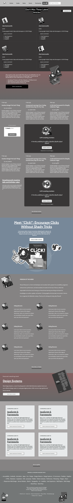

# Smashing_Magazines

# A Smashing magazine article clone for microverse

## Built With

- HTML & CSS

## Live Demo

[Live Demo Link](https://rawcdn.githack.com/che30/Smashing_Magazines/ff765165eadb5071391954cc5ecc5d294474b2b1/index.html)

## Authors

**Marcelo Araújo**

- GitHub: [@marcelomaidden](https://github.com/marcelomaidden)
- Twitter: [@marcelomaidden](https://twitter.com/marcelomaidden)
- LinkedIn: [Marcelo Fernandes de Araújo](https://www.linkedin.com/in/marcelo-fernandes-de-ara%C3%BAjo-56700a171/)

**Che Blanchard**

- GitHub: [@che30](https://github.com/che30)
- Twitter: [@BlanchardNsoh](https://twitter.com/BlanchardNsoh )
- LinkedIn: [Che Blanchard](https://www.linkedin.com/in/che-nsoh-9455271b0/)

## Acknowledgements
- Smashing magazine
- W3 schools
- Google fonts
- Font awesome

##  Contributing

Contributions, issues, and feature requests are welcome!

## Show your support

Give a ⭐️ if you like this project!

## License

This project is [MIT](./LICENSE) licensed.